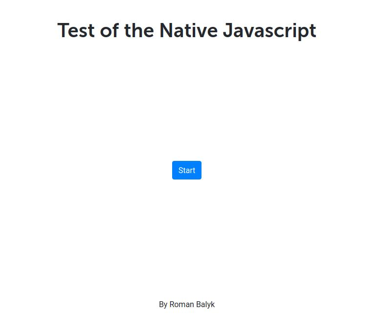

## Test of the native JavaScript

 
## Requirements for the environment
To create an environment you need to have the following installed tools:
- Node.js
- git
- Gulp

If you do not have these tools, then you need to install them.

## Dependencies of the project
To install the dependencies of the project, you must enter commands at the command prompt:
- `npm install`

## How to use the environment
Return to normal mode: enter `gulp` in the command line.
Selective assembly: In the command line, enter the desired task. For example, to compile CSS, you need to type the `css: build` command. A list of all available tasks can be found in the gulpfile.js file.

gulp build is the first time it takes longer than creating a server. Therefore, after the first start, you need to reload the page after 10 seconds and continue to work.

When creating new js files or new font directories, you need to restart gulp

Gulpfile.js file:
- server for work and automatic updating of pages
- module for error tracking
- module for importing data from one file to another
- module for compiling SASS (SCSS) in CSS
- module for auto-prefixes
- CSS minification plugin
- module for jailing JavaScript, when you add new js files you need to restart gulp
- module for caching
- Plugin for compressing PNG, JPEG, GIF and SVG images
- jpeg compression plugin
- plugin for compressing png
- plugin for deleting files from a directory